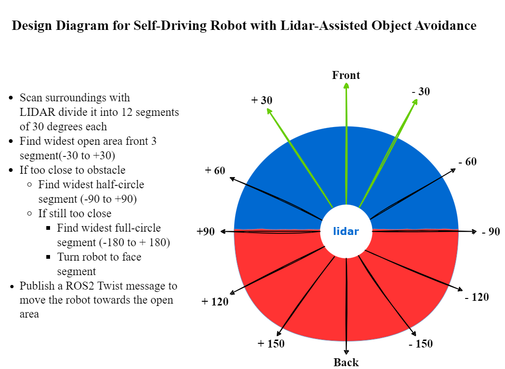
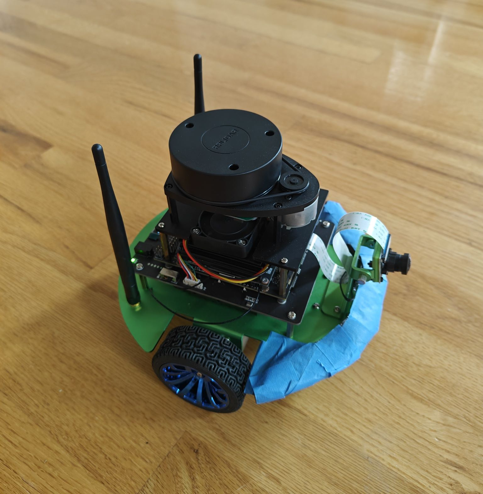
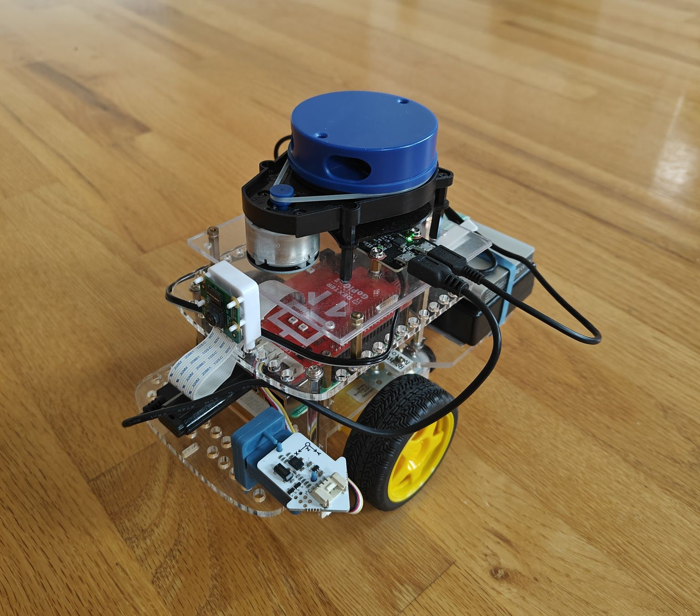

# Jetbot Tools with Jetson Inference DNN Vision Library for NAV2 ROS2 Robot
Jetbot tools is a set of ROS2 nodes that utilize the Jetson inference DNN vision library for NVIDIA Jetson. With Jetbot tools, you can build your own low-cost 2-wheel robot with a camera and a lidar sensor and make it do the following amazing things:

- Lidar-assisted object avoidance self-driving: Your robot can navigate autonomously and avoid obstacles using the lidar sensor.
- Real-time object detection and tracking: Your robot can detect objects using the SSD Mobilenet V2 model. You can also make your robot follow a specific object that it detects.
- Real-time object detection and distance measurement: Your robot can detect and measure the distance of objects using the SSD Mobilenet V2 model and the lidar sensor. You can also make your robot follow a specific object that it detects and stop when it is too close to the object.
- NAV2 TF2 position tracking and following: Your robot can track its own position and follow another Jetbot robot using the NAV2 TF2 framework.

#### Here is a brief overview of the jetbot tools design diagram/architecture

### Jetbot tools source code and video demos:
---
- **Lidar-assisted object avoidance self-driving:**
  - Code logic explanation:
    - Use the LIDAR sensor to collect data from all directions and divide it into 12 segments of 30 degrees each
    - Compare the distances of the objects in the first three segments (front 90 degrees) and select the segment with the farthest open area
    - If the object in the selected segment is closer than a threshold distance to the target object
      - Repeat the comparison for the first six segments (front 180 degrees) and select the segment with the farthest object
      - If the object in the selected segment is still closer than the threshold distance to the target object
        - Repeat the comparison for all 12 segments (360 degrees) and select the segment with the farthest open area
          - Rotate the robot to face the selected segment
    - Publish a ROS2 Twist message to move the robot towards the open area 
  - Source code:
    - [launch file: laser_avoidance.launch.py](launch/laser_avoidance.launch.py)  
    - [ROS2 node: laser_avoidance.py](jetbot_tools/script/laser_avoidance.py)  
  - Usage:
    - ros2 launch jetbot_tools laser_avoidance.launch.py param_file:=./jetbot_tools/param/laser_avoidance_params.yaml
    - ros2 param get /laser_avoidance start
    - ros2 param set /laser_avoidance start true  
   
- **Real-time object detection and tracking:**
  - Code logic explanation:
    - Use Jetson DNN inference ROS2 detectnet node to detect the targeting object position of the image capture from camera
      - https://github.com/dusty-nv/ros_deep_learning#detectnet-node-1
    - Calculate the angle between the image center and the targeting position
    - Use the size of the detected image to determine the distance between robot to the target
    - Send a ROS2 Twist message to move the robot follow the detection object
    - Stop the robot if it is too close to the target
  - Source code:
    - [launch file: detect_copilot.launch.py](launch/detect_copilot.launch.py) 
    - [ROS2 node: detect_copilot.py](jetbot_tools/script/detect_copilot.py)
  - Usage:
    - ros2 launch jetbot_tools DNN_SSD_source.launch.py model_path:=/home/jetbot/dev_ws/pytorch-ssd/models/toy/ssd-mobilenet.onnx class_labels_path:=/home/jetbot/dev_ws/pytorch-ssd/models/toy/labels.txt launch_video_source:=false topic:=/video_source/raw
    - ros2 launch jetbot_tools detect_copilot.launch.py param_file:=./jetbot_tools/param/detect_toys_copilot_params.yaml
    - ros2 param get /detect_copilot follow_detect
    - ros2 param set /detect_copilot follow_detect true  
  
  
- **Real-time object detection and distance measurement:**
  - Code logic explanation:
    - Use Jetson DNN inference ROS2 detectnet node to detect the targeting object position of the image capture from camera
      - https://github.com/dusty-nv/ros_deep_learning#detectnet-node-1
    - The LIDAR sensor collected 360-degree ROS2 LaserScan raw data
      - http://docs.ros.org/en/api/sensor_msgs/html/msg/LaserScan.html
    - Calculate the rotation angle by measuring the difference between the camera’s field of view (FOV) and the detection image position
    - Use lidar data on rotation angle to calculate the distance of an object
    - Send a ROS2 Twist message to move the robot follow the detection object
    - Stop the robot if it is too close to the target
  - Source code:
    - [launch file: follow_copilot.launch.py](launch/follow_copilot.launch.py)
    - [ROS2 node: follow_copilot.py](jetbot_tools/script/follow_copilot.py)
  - Usage:
    - ros2 launch jetbot_tools DNN_SSD_source.launch.py model_name:=ssd-mobilenet-v2 launch_video_source:=false topic:=/video_source/raw
    - ros2 launch jetbot_tools follow_copilot.launch.py param_file:=./jetbot_tools/param/follow_copilot_params.yaml
    - ros2 param get /follow_copilot follow_detect
    - ros2 param set /follow_copilot follow_detect true  
  
- **NAV2 TF2 position tracking and following:**
  - Code logic explanation:
    - To run this tf2_follow_copilot program, you need two robots that can use tf2 broadcaster to publish their coordinate frames.
    - The tf2_follow_copilot program uses a tf2 listener to calculate the difference between the robot frames and determine the direction and distance to follow.
    - The program publishes a ROS2 Twist message to control the GoPiGo3 robot's speed and steering, so that it can follow the jetbot robot.
  - Source code:
    - [launch file: tf2_follow_copilot.launch.py](launch/tf2_follow_copilot.launch.py)
    - [ROS2 node: tf2_listener_copilot.py](jetbot_tools/script/tf2_listener_copilot.py)
  - Usage:
    - Pre requirements: ros2 launch <follow_copilot.launch.py> or <detect_copilot.launch.py>
    - ros2 launch jetbot_tools tf2_follow_copilot.launch.py param_file:=./jetbot_tools/param/tf2_follow_copilot_params.yaml
    - ros2 param set /tf2_follow start_follow true  
     
    
### Requirements:
- Jetson Nano:
  - Ububnu 20.04: https://qengineering.eu/install-ubuntu-20.04-on-jetson-nano.html
  - ROS2 foxy: https://docs.ros.org/en/foxy/index.html
  - Jetson inference and realtime vision DNN library: https://github.com/dusty-nv/jetson-inference
  - Jetson Inference Nodes for ROS2: https://github.com/dusty-nv/ros_deep_learning  
    
- Host Virtual Machine:
  - Ubuntu 20.04 LTS (Focal Fossa):https://www.releases.ubuntu.com/focal/ 
  - ROS2 foxy: https://docs.ros.org/en/foxy/index.html
  - NAV2 : https://navigation.ros.org/  
    

      
      
    

- Robot:
  - Jetson Nano Jetbot: https://www.waveshare.com/wiki/JetBot_ROS_AI_Kit
    - https://github.com/waveshare/jetbot_pro  
  - GoPiGo3: https://www.dexterindustries.com/gopigo3/
    - https://github.com/ros-gopigo3/gopigo3
    - https://github.com/slowrunner/ROS2-GoPiGo3
    

      
      
    

 
    
### References
- https://qengineering.eu/install-ubuntu-20.04-on-jetson-nano.html
- https://docs.ros.org/en/foxy/index.html
- https://navigation.ros.org/
- https://github.com/dusty-nv/jetson-inference
- https://github.com/dusty-nv/ros_deep_learning
- https://automaticaddison.com/the-ultimate-guide-to-the-ros-2-navigation-stack/
