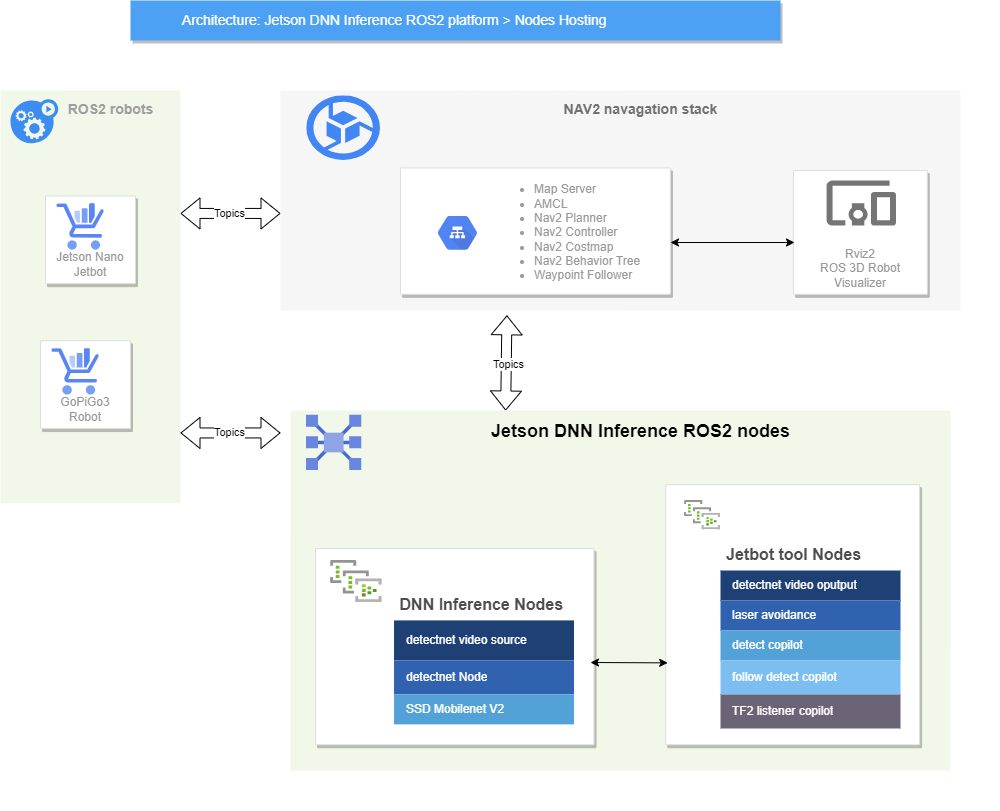
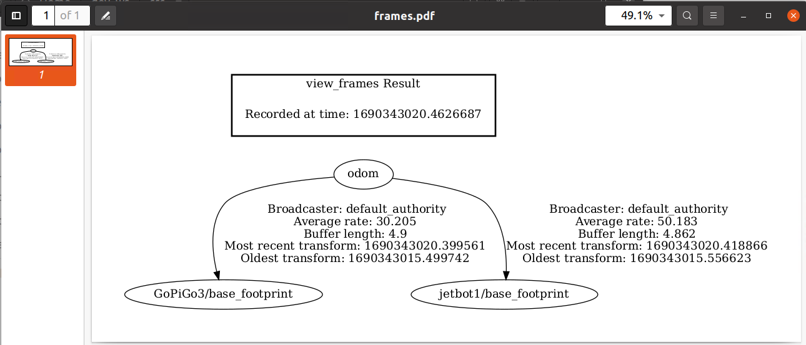
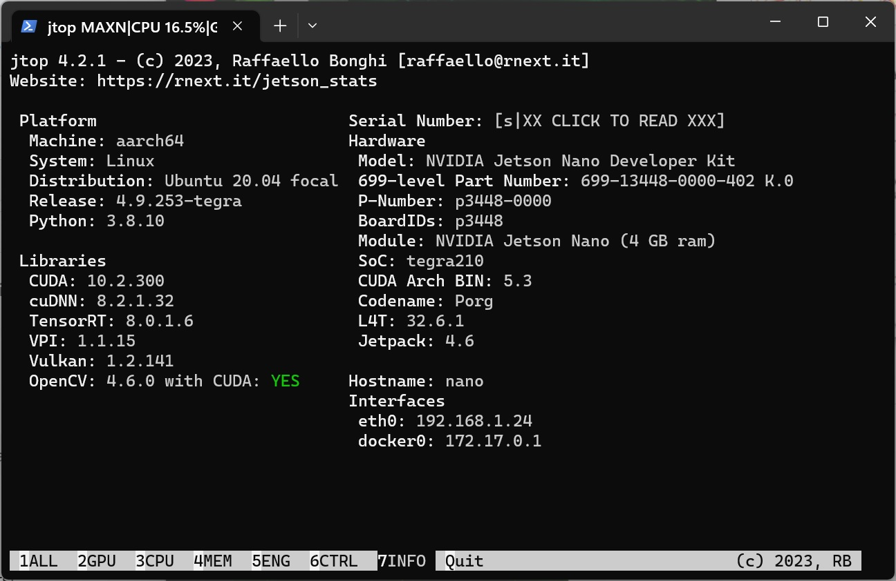
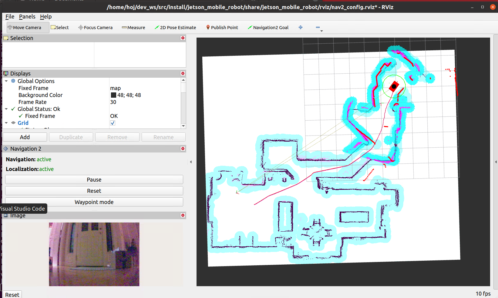

# jetbot_tools
Jetbot tools is a set of ROS2 nodes that uses the Jetson inference DNN vision library for NVIDIA Jetson. With Jetbot tools, you can build your own low-cost 2-wheel robot with a camera and a lidar sensor and make it do the following amazing things:

- Lidar-assisted object avoidance self-driving: Your robot can navigate autonomously and avoid obstacles using the lidar sensor.
- Real-time object detection and tracking: Your robot can detect objects using the SSD Mobilenet V2 model. You can also make your robot follow a specific object that it detects.
- Real-time object detection and distance measurement: Your robot can detect and measure the distance of objects using the SSD Mobilenet V2 model and the lidar sensor. You can also make your robot follow a specific object that it detects and stop when it is too close to the object.
- NAV2 TF2 position tracking and following: Your robot can track its own position and follow another Jetbot robot using the NAV2 TF2 framework.

#### Here is a brief overview of the jetbot tools design diagram/architecture

### Jetbot tools video demos:
##### Lidar-assisted object avoidance self-driving:
  
##### Real-time object detection and tracking:
  
  
##### Real-time object detection and distance measurement:
  
##### NAV2 TF2 position tracking and following:
  []

  

### Requirements:
- Jetson Nano:
  - Ububnu 20.04: https://qengineering.eu/install-ubuntu-20.04-on-jetson-nano.html
  - ROS2 foxy: https://docs.ros.org/en/foxy/index.html
  - Jetson inference and realtime vision DNN library: https://github.com/dusty-nv/jetson-inference
  - Jetson Inference Nodes for ROS2: https://github.com/dusty-nv/ros_deep_learning  
    
- Host Virtual Machine:
  - Ubuntu 20.04 LTS (Focal Fossa):https://www.releases.ubuntu.com/focal/ 
  - ROS2 foxy: https://docs.ros.org/en/foxy/index.html
  - NAV2 : https://navigation.ros.org/  
    

      
      
    

### References
- https://qengineering.eu/install-ubuntu-20.04-on-jetson-nano.html
- https://docs.ros.org/en/foxy/index.html
- https://navigation.ros.org/
- https://github.com/dusty-nv/jetson-inference
- https://github.com/dusty-nv/ros_deep_learning
- https://github.com/waveshare/jetbot_pro
- https://github.com/slowrunner/ROS2-GoPiGo3
- https://automaticaddison.com/the-ultimate-guide-to-the-ros-2-navigation-stack/
