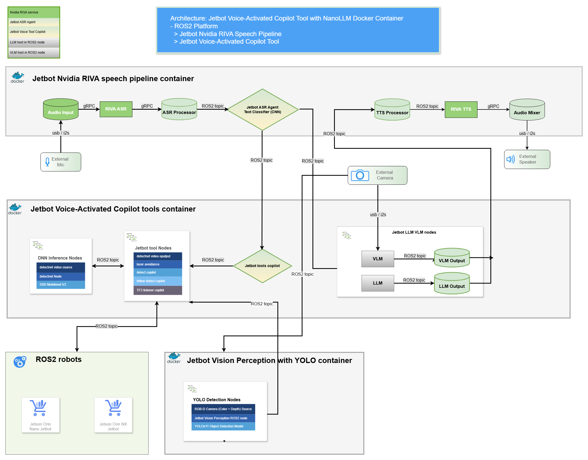
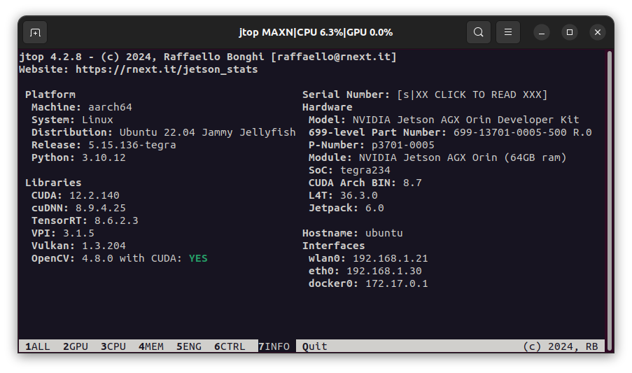
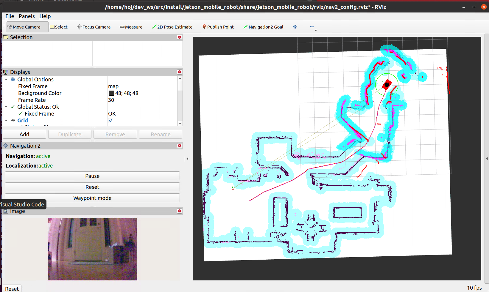
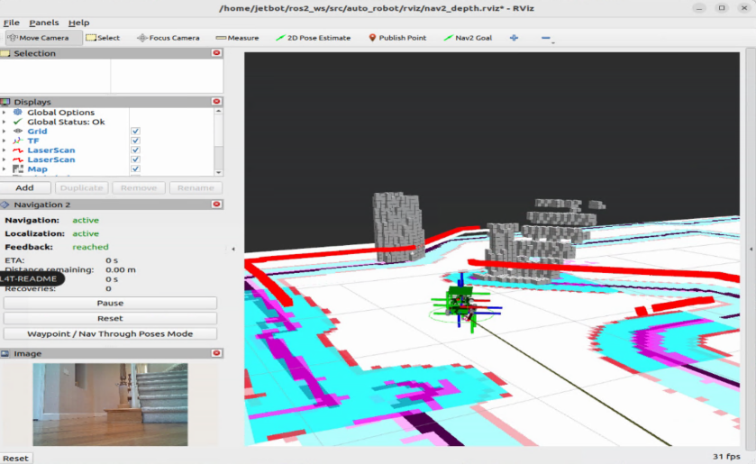
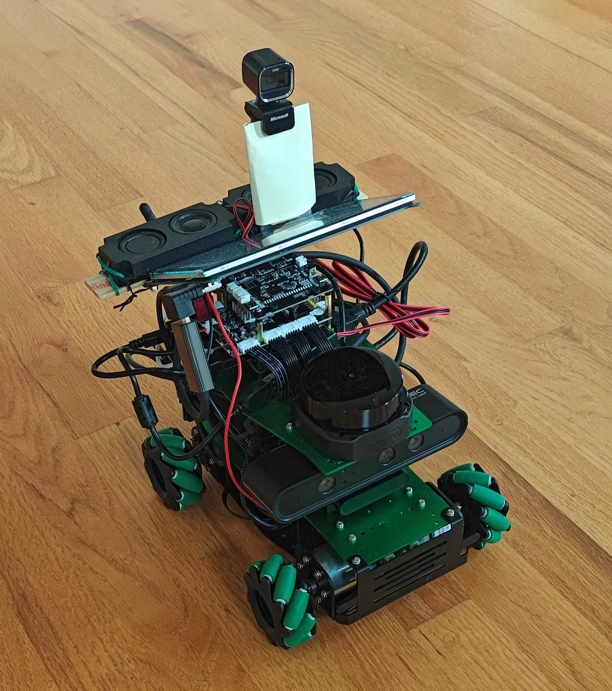
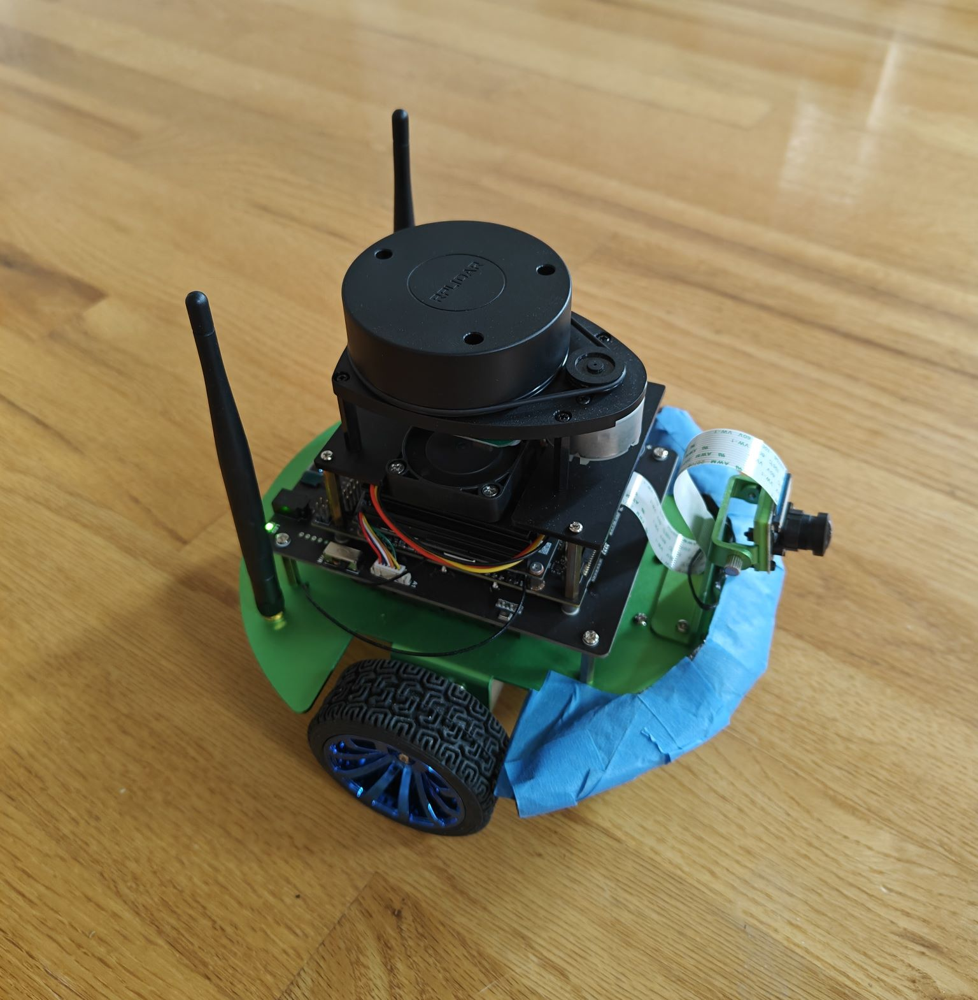
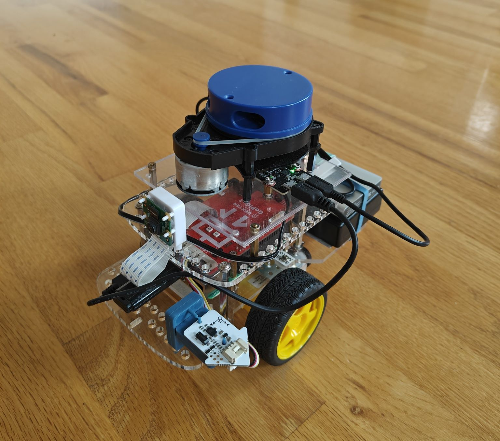

# Jetbot Tools with YOLOv11 Vision Detection and NanoLLM Container for NAV2 ROS2 Robot — Version 2.1

Jetbot Tools is a collection of ROS2 nodes that integrate a YOLO‑based vision system and the Jetson NanoLLM Docker container for NVIDIA Jetson Orin platforms. With Jetbot Tools, you can build a cost‑effective two‑wheel robot equipped with a depth camera and a lidar sensor, enabling it to perform the following impressive tasks

- **Voice-Activated Copilot**: Unleash the power of voice control for your ROS2 robot with [Jetbot Voice-Activated Copilot Tools](https://github.com/Jen-Hung-Ho/ros2_jetbot_voice).
- **Jetbot Tools Task Copilot** (NEW in v2.1): Manage and coordinate all Jetbot Tools tasks through a unified ROS2 Action interface. The Task Copilot can start, stop, or interrupt long‑running operations, ensuring smooth cooperation between modules. When a voice‑activated command is received, it can automatically stop any currently running tasks and cleanly transition the robot into the newly requested action.
- **Large Language Model (LLM) Chat**: Empower your Jetbot to respond using LLM chat. By default, it utilizes the [`meta-llama/Llama-2-7b-chat-hf`](https://huggingface.co/meta-llama/Llama-2-7b-chat-hf) model hosted in a ROS2 node.
- **Vision-Language Model (VLM) Robot Camera Image Description**: Enable your Jetbot to describe images captured by its camera. By default, it employs the [`Efficient-Large-Model/VILA1.5-3b`](https://huggingface.co/Efficient-Large-Model/VILA1.5-3b) model hosted in a ROS2 node.
- **Depth‑Camera Vision Object Avoidance Self‑Driving** (NEW in v2.1): Enable your robot to navigate autonomously using depth‑camera vision, allowing it to detect obstacles in 3D space and perform smooth, vision‑based avoidance behaviors.
- **Lidar-Assisted Object Avoidance Self-Driving**: Enable your robot to navigate autonomously and avoid obstacles using the lidar sensor.
- **Real-Time Object Detection and Tracking**: Allow your robot to detect objects using the SSD Mobilenet V2 model. You can also make your robot follow a specific object that it detects.
- **Real-Time Object Detection and Distance Measurement** (NEW in v2.1): Enable your robot to detect objects using the YOLOv11 vision system and measure their distance with the depth camera. You can also make your robot follow a selected object and automatically stop when it gets too close.
- **NAV2 TF2 Position Tracking and Following**: Allow your robot to track its own position and follow another Jetbot robot using the NAV2 TF2 framework.

#### Here is a brief overview of the jetbot tools design diagram/architecture

### Setup
  - [Jetbot Tools Setup Guide](docs/setup.md#setup)

### Jetbot tools source code and video demos:
---
- [**Empower your robot with Voice-Activated Copilot Tool**](docs/voice_activated_copilot.md)
  
- [**Depth‑Camera Vision–Assisted Object Avoidance Self‑Driving (NEW in v2.1)**](docs/depth_camera_avoidance.md)
  
- [**Lidar-assisted object avoidance self-driving**](docs/lidar_avoidance.md)
  
- [**Real-time object detection and tracking**](docs/object_detection_tracking.md)
  
- [**Real-time object detection and distance measurement (NEW in v2.1)**](docs/object_detection_distance.md)
  
- [**NAV2 TF2 position tracking and following**](docs/nav2_tf2_tracking.md)
  
### Requirements:
- Jetson Orin Nano or Jetson Orin NX:
  - https://developer.nvidia.com/embedded/learn/get-started-jetson-agx-orin-devkit#what-youll-need
  - ROS2 humble: https://docs.ros.org/en/humble/index.html
  - NanoLLM docker container: https://github.com/dusty-nv/NanoLLM
  - NanoLLM docker container for ROS2: https://github.com/NVIDIA-AI-IOT/ros2_nanollm  
    
- Host Virtual Machine:
  - Ubuntu 22.04.5 LTS (Jammy Jellyfish):https://releases.ubuntu.com/jammy/ 
  - ROS2 humble: https://docs.ros.org/en/humble/index.html
  - NAV2 : https://wiki.ros.org/navigation  
    

      
      
    

- Robot:
  - Jetson Orin Jetbot: http://www.yahboom.net/study/ROSMASTER-X3
    - [ROSMASTER_X3_Code](https://drive.google.com/drive/folders/1QuXJcrRMs8oyTrrROKMnUNvTHImcIC78)
  - Jetson Nano Jetbot: https://www.waveshare.com/wiki/JetBot_ROS_AI_Kit
    - https://github.com/waveshare/jetbot_pro  
  - GoPiGo3: https://www.dexterindustries.com/gopigo3/
    - https://github.com/ros-gopigo3/gopigo3
    - https://github.com/slowrunner/ROS2-GoPiGo3
    

      
      
      
    

 
    
### References
- https://qengineering.eu/install-ubuntu-20.04-on-jetson-nano.html
- https://developer.nvidia.com/embedded/learn/get-started-jetson-agx-orin-devkit#what-youll-need
- https://docs.ros.org/en/humble/index.html
- https://docs.nav2.org/index.html
- https://github.com/dusty-nv/NanoLLM
  - https://github.com/dusty-nv/jetson-inference
  - https://github.com/dusty-nv/ros_deep_learning
  - https://github.com/dusty-nv/jetson-voice
  - https://github.com/dusty-nv/jetson-voice/tree/master/ros/jetson_voice_ros
- https://www.jetson-ai-lab.com/tutorial_llamaspeak.html
- https://www.jetson-ai-lab.com/archive/tutorial_ultralytics.html
- https://github.com/Jen-Hung-Ho/ros2_jetbot_voice
- https://github.com/Jen-Hung-Ho/jetbot_vision_perception
- https://automaticaddison.com/the-ultimate-guide-to-the-ros-2-navigation-stack/
