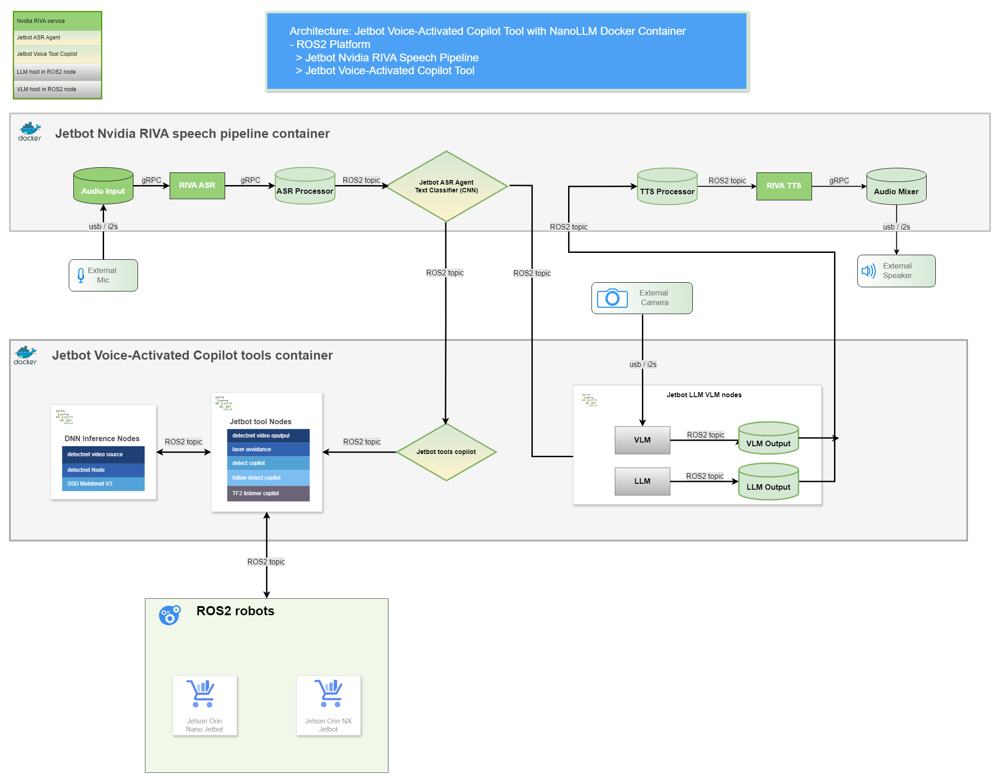
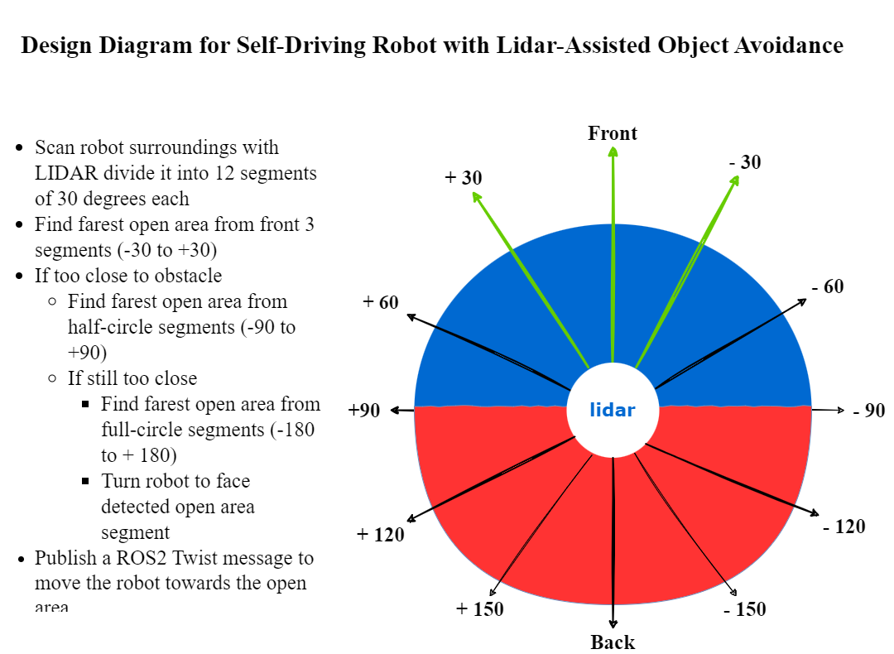

# Jetbot Tools with Jetson Inference DNN Vision Library and NanoLLM Container for NAV2 ROS2 Robot - Version 2.0

Jetbot Tools is a collection of ROS2 nodes that leverage the Jetson Inference DNN Vision Library and the Jetson NanoLLM Docker container for NVIDIA Jetson. With Jetbot Tools, you can build a cost-effective, two-wheel robot equipped with a camera and a lidar sensor, enabling it to perform the following impressive tasks:

- **Voice-Activated Copilot**: Unleash the power of voice control for your ROS2 robot with [Jetbot Voice-Activated Copilot Tools](https://github.com/Jen-Hung-Ho/ros2_jetbot_voice).
- **Large Language Model (LLM) Chat**: Empower your Jetbot to respond using LLM chat. By default, it utilizes the [`meta-llama/Llama-2-7b-chat-hf`](https://huggingface.co/meta-llama/Llama-2-7b-chat-hf) model hosted in a ROS2 node.
- **Vision-Language Model (VLM) Robot Camera Image Description**: Enable your Jetbot to describe images captured by its camera. By default, it employs the [`Efficient-Large-Model/VILA1.5-3b`](https://huggingface.co/Efficient-Large-Model/VILA1.5-3b) model hosted in a ROS2 node.
- **Lidar-Assisted Object Avoidance Self-Driving**: Enable your robot to navigate autonomously and avoid obstacles using the lidar sensor.
- **Real-Time Object Detection and Tracking**: Allow your robot to detect objects using the SSD Mobilenet V2 model. You can also make your robot follow a specific object that it detects.
- **Real-Time Object Detection and Distance Measurement**: Enable your robot to detect and measure the distance of objects using the SSD Mobilenet V2 model and the lidar sensor. You can also make your robot follow a specific object and stop when it is too close.
- **NAV2 TF2 Position Tracking and Following**: Allow your robot to track its own position and follow another Jetbot robot using the NAV2 TF2 framework.

#### Here is a brief overview of the jetbot tools design diagram/architecture

### Setup
  - [Jetbot Tools Setup Guide](docs/setup.md#setup)

### Jetbot tools source code and video demos:
---
- **Empower your robot with Voice-Activated Copilot Tool:**
  - Unleash the power of voice control for your ROS2 robot with the [Jetbot Voice-Activated Copilot Tool!](https://github.com/Jen-Hung-Ho/ros2_jetbot_voice)
  - The Jetbot Voice-Activated Copilot Tool integrates the [Nvidia RIVA (ASR-TTS) service](https://docs.nvidia.com/deeplearning/riva/user-guide/docs/overview.html) and a simple 1D convolutional neural network (CNN) model for text classification, empowering your robot to understand and respond to spoken commands. Enhance interactions with features such as natural chat greetings, conversational capabilities via Large Language Models (LLM), Visual Language Models (VLM) for vision processing, object avoidance, autonomous self-driving, real-time person following, and fundamental robot navigation movements.  
  - Source code:
    - [ROS2 node: llm_chat_agent.py](jetbot_tools/script/llm_chat_agent.py)
    - [ROS2 node: llm_vision_agent.py](jetbot_tools/script/llm_vision_agent.py)
    - [param file: jetbot_voice_copilot_params.yaml](param/jetbot_voice_copilot_params.yaml)
    - [launch file: jetbot_tools_voice.launch.py](launch/jetbot_tools_voice.launch.py)
    - [ROS2 node: jetbot_tools_copilot.py](jetbot_tools/script/jetbot_tools_copilot.py)
  - Usage:
    - ros2 run jetbot_tools llm_chat_agent
    - ros2 run jetbot_tools llm_vision_agent
    - ros2 launch jetbot_tools jetbot_tools_voice.launch.py param_file:=./jetbot_tools/param/jetbot_voice_copilot_params.yaml
  
- **Lidar-assisted object avoidance self-driving:**
  - Code logic explanation:
    - Use the LIDAR sensor to collect data from all directions and divide it into 12 segments of 30 degrees each
    - Compare the distances of the objects in the first three segments (front 90 degrees) and select the segment with the farthest open area
    - If the object in the selected segment is closer than a threshold distance to the target object
      - Repeat the comparison for the first six segments (front 180 degrees) and select the segment with the farthest object
      - If the object in the selected segment is still closer than the threshold distance to the target object
        - Repeat the comparison for all 12 segments (360 degrees) and select the segment with the farthest open area
          - Rotate the robot to face the selected segment
    - Publish a ROS2 Twist message to move the robot towards the open area 
  - Source code:
    - [launch file: laser_avoidance.launch.py](launch/laser_avoidance.launch.py)  
    - [ROS2 node: laser_avoidance.py](jetbot_tools/script/laser_avoidance.py)  
  - Usage:
    - ros2 launch jetbot_tools laser_avoidance.launch.py param_file:=./jetbot_tools/param/laser_avoidance_params.yaml
    - ros2 param get /laser_avoidance start
    - ros2 param set /laser_avoidance start true  
   
- **Real-time object detection and tracking:**
  - Code logic explanation:
    - Use Jetson DNN inference ROS2 detectnet node to detect the targeting object position of the image capture from camera
      - https://github.com/dusty-nv/ros_deep_learning#detectnet-node-1
    - Calculate the angle between the image center and the targeting position
    - Use the size of the detected image to determine the distance between robot to the target
    - Send a ROS2 Twist message to move the robot follow the detection object
    - Stop the robot if it is too close to the target
  - Source code:
    - [launch file: detect_copilot.launch.py](launch/detect_copilot.launch.py) 
    - [ROS2 node: detect_copilot.py](jetbot_tools/script/detect_copilot.py)
  - Usage:
    - ros2 launch jetbot_tools DNN_SSD_source.launch.py model_path:=/home/jetbot/dev_ws/pytorch-ssd/models/toy/ssd-mobilenet.onnx class_labels_path:=/home/jetbot/dev_ws/pytorch-ssd/models/toy/labels.txt launch_video_source:=false topic:=/video_source/raw
    - ros2 launch jetbot_tools detect_copilot.launch.py param_file:=./jetbot_tools/param/detect_toys_copilot_params.yaml
    - ros2 param get /detect_copilot follow_detect
    - ros2 param set /detect_copilot follow_detect true  
  
  
- **Real-time object detection and distance measurement:**
  - Code logic explanation:
    - Use Jetson DNN inference ROS2 detectnet node to detect the targeting object position of the image capture from camera
      - https://github.com/dusty-nv/ros_deep_learning#detectnet-node-1
    - The LIDAR sensor collected 360-degree ROS2 LaserScan raw data
      - http://docs.ros.org/en/api/sensor_msgs/html/msg/LaserScan.html
    - Calculate the rotation angle by measuring the difference between the camera’s field of view (FOV) and the detection image position
    - Use lidar data on rotation angle to calculate the distance of an object
    - Send a ROS2 Twist message to move the robot follow the detection object
    - Stop the robot if it is too close to the target
  - Source code:
    - [launch file: follow_copilot.launch.py](launch/follow_copilot.launch.py)
    - [ROS2 node: follow_copilot.py](jetbot_tools/script/follow_copilot.py)
  - Usage:
    - ros2 launch jetbot_tools DNN_SSD_source.launch.py model_name:=ssd-mobilenet-v2 launch_video_source:=false topic:=/video_source/raw
    - ros2 launch jetbot_tools follow_copilot.launch.py param_file:=./jetbot_tools/param/follow_copilot_params.yaml
    - ros2 param get /follow_copilot follow_detect
    - ros2 param set /follow_copilot follow_detect true  
  
- **NAV2 TF2 position tracking and following:**
  - Code logic explanation:
    - To run this tf2_follow_copilot program, you need two robots that can use tf2 broadcaster to publish their coordinate frames.
    - The tf2_follow_copilot program uses a tf2 listener to calculate the difference between the robot frames and determine the direction and distance to follow.
    - The program publishes a ROS2 Twist message to control the GoPiGo3 robot's speed and steering, so that it can follow the jetbot robot.
  - Source code:
    - [launch file: tf2_follow_copilot.launch.py](launch/tf2_follow_copilot.launch.py)
    - [ROS2 node: tf2_listener_copilot.py](jetbot_tools/script/tf2_listener_copilot.py)
  - Usage:
    - Pre requirements: ros2 launch <follow_copilot.launch.py> or <detect_copilot.launch.py>
    - ros2 launch jetbot_tools tf2_follow_copilot.launch.py param_file:=./jetbot_tools/param/tf2_follow_copilot_params.yaml
    - ros2 param set /tf2_follow start_follow true  
     
    
### Requirements:
- Jetson Orin Nano or Jetson Orin NX:
  - https://developer.nvidia.com/embedded/learn/get-started-jetson-agx-orin-devkit#what-youll-need
  - ROS2 humble: https://docs.ros.org/en/humble/index.html
  - NanoLLM docker container: https://github.com/dusty-nv/NanoLLM
  - NanoLLM docker container for ROS2: https://github.com/NVIDIA-AI-IOT/ros2_nanollm  
    
- Host Virtual Machine:
  - Ubuntu 22.04.5 LTS (Jammy Jellyfish):https://releases.ubuntu.com/jammy/ 
  - ROS2 humble: https://docs.ros.org/en/humble/index.html
  - NAV2 : https://wiki.ros.org/navigation  
    

      
      
    

- Robot:
  - Jetson Orin Jetbot: http://www.yahboom.net/study/ROSMASTER-X3
    - [ROSMASTER_X3_Code](https://drive.google.com/drive/folders/1QuXJcrRMs8oyTrrROKMnUNvTHImcIC78)
  - Jetson Nano Jetbot: https://www.waveshare.com/wiki/JetBot_ROS_AI_Kit
    - https://github.com/waveshare/jetbot_pro  
  - GoPiGo3: https://www.dexterindustries.com/gopigo3/
    - https://github.com/ros-gopigo3/gopigo3
    - https://github.com/slowrunner/ROS2-GoPiGo3
    

      
      
      
    

 
    
### References
- https://qengineering.eu/install-ubuntu-20.04-on-jetson-nano.html
- https://developer.nvidia.com/embedded/learn/get-started-jetson-agx-orin-devkit#what-youll-need
- https://docs.ros.org/en/humble/index.html
- https://navigation.ros.org/
- https://github.com/dusty-nv/NanoLLM
  - https://github.com/dusty-nv/jetson-inference
  - https://github.com/dusty-nv/ros_deep_learning
  - https://github.com/dusty-nv/jetson-voice
  - https://github.com/dusty-nv/jetson-voice/tree/master/ros/jetson_voice_ros
- https://www.jetson-ai-lab.com/tutorial_llamaspeak.html
- https://github.com/Jen-Hung-Ho/ros2_jetbot_voice
- https://automaticaddison.com/the-ultimate-guide-to-the-ros-2-navigation-stack/
